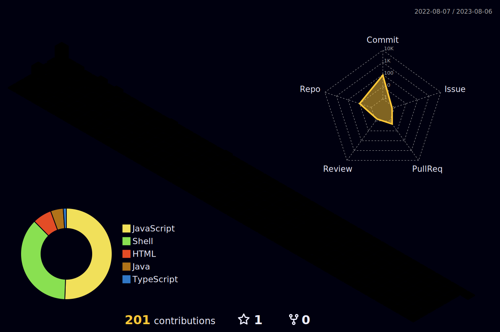

<h1 align="left">  <3 </h1>
<!--  -->
[dewfa](https://readme-typing-svg.herokuapp.com)

🎓 I am an Undergraduate student currently pursuing Computer Science and Biosciences from [IIIT Delhi](https://iiitd.ac.in/)

👨‍💻 I have a keen interest in Artificial Intelligence and Machine Learning, 
   and am looking forward to collaborate and enter this field in the future.

🤝 I am also open for any project ideas or collaboration. 
   You can connect with me from the handles given below for collaboration or anything else.

<!-- 
  
 -->

<!-- 
  
 -->
<h2 align="left">🛠️ Skills</h2>
<h3 align="left">Languages:</h3>
    
    
   
   
   
      <!-- 

 -->

<h3 align="left">Tools:</h3>
   
    
    
   
    
    
    
    
    
   
    

<h2 align="left">📈 Github Stats:</h2>

&nbsp;

<h2 align="left">🔗 Connect with me:</h2>

  

<!--# **Hi there** 

🎓 I am an Undergraduate student currently pursuing Computer Science and Biosciences from [IIIT Delhi](https://iiitd.ac.in/).

👨‍💻 I have a keen interest in Artificial Intelligence and Machine Learning, 
   and am looking forward to collaborate and enter this field in the future.

🤝 I am also open for any project ideas or collaboration. 
   You can connect with me from the handles given below for collaboration or anything else.

## 🛠️ **Skills**

### **Languages** 
 -->
<!--  -->

<!--
**debjit20504/debjit20504** is a ✨ _special_ ✨ repository because its `README.md` (this file) appears on your GitHub profile.

Here are some ideas to get you started:

- 🔭 I’m currently working on ...
- 🌱 I’m currently learning ...
- 👯 I’m looking to collaborate on ...
- 🤔 I’m looking for help with ...
- 💬 Ask me about ...
- 📫 How to reach me: ...
- 😄 Pronouns: ...
- ⚡ Fun fact: ...
-->

